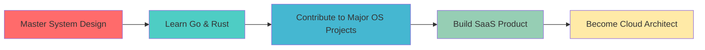

# 🚀 Manish Patil

### Software Developer | Tech Enthusiast | Problem Solver

---

## 🌟 Philosophy

> *"Code is like humor. When you have to explain it, it's bad."* – Cory House  
> *"The best way to predict the future is to invent it."* – Alan Kay

---

## 🏆 GitHub Profile Trophies

  

## 🔥 GitHub Streak

  

## 🚀 GitHub Stats

  

---

## 💻 Tech Stack & Skills

### Languages

### 🛠️ Frameworks & Libraries

#### Web

#### Mobile

#### Backend & Database

### ☁️ Cloud & DevOps

### 🧰 Tools & Others

---

## 🎯 2025 Coding Goals

---

## 📊 GitHub Analytics

---

## 💼 What I'm Currently Working On

- 🔭 Building a **cloud-native microservices architecture** for scalable applications
- 🌱 Learning **Kubernetes** and **DevOps best practices**
- 👯 Looking to collaborate on **open-source projects** related to web development
- 🤝 Exploring **AI/ML integration** in modern web applications
- 💡 Writing technical blogs about **software engineering patterns**

---

## 📫 Connect With Me

---

## ⚡ Fun Facts About Me

- 🎮 I'm a gaming enthusiast who loves strategy games
- ☕ Tea is my debugging fuel - can't code without it!
- 🎵 I listen to lofi hip hop while coding for maximum productivity
- 🏃 Marathon runner - believe in keeping both mind and body fit
- 📚 Avid reader of sci-fi novels and tech books
- 🌍 Dream of contributing to tech that makes a global impact

---

### 💭 Random Dev Quote

### 🐍 Contribution Snake

---

### Show some ❤️ by starring some of the repositories!

---

  **"First, solve the problem. Then, write the code."** - Manish S Patil

⭐ From [ManishPatil011](https://github.com/ManishPatil011)

